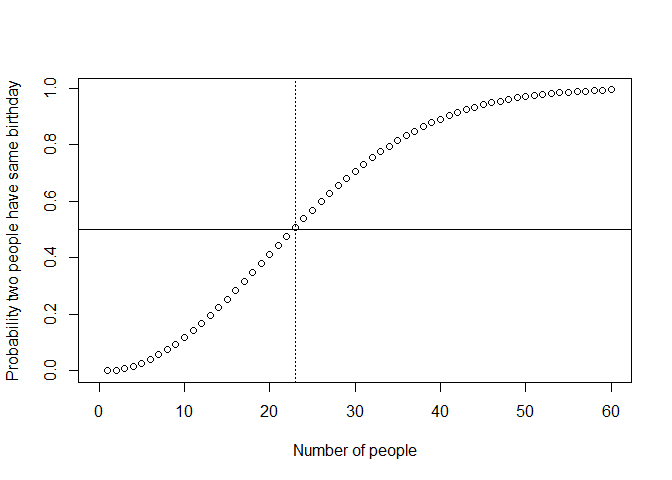

The Birthday Paradox
================
November 2016

Housekeeping

``` r
## Load packages via Pacman
pacman::p_load(rmarkdown)

## Set the working directory
# setwd("Enter Your Location Here")

## Change printing options
options(scipen = 999, digits = 3)
```

Some background information

``` r
## Pr(at least 2 people have same bday) = 1 - P(nobody has same bday)
## Or, we can solve an easier problem (using the equality rule): 
## Pr(nobody has same bday) = 1 - Pr(at least 2 people have same bday)
##
## Pr(A) = (# of elements in A) / (# of elements in sample space)
## Pr(nobody has same bday) = (# unique pairs) / (# of total pairs)
## Pr(nobody has same bday) = 365Permutationk / 365^k
## Pr(nobody has same bday) = 365! / 365^k(365 - k)!
## Pr(at least 2 people have same bday) = 1 - (365! / 365^k(365 - k)!)
```

Option 1: Create a function to calculate the probability of two people sharing the same birthday

``` r
birthday <- function(k) {
    logdenom <- k * log(365) + lfactorial(365 - k) # log denominator
    lognumer <- lfactorial(365) # log numerator
    ## P(at least two have the same bday) = 1 - P(nobody has the same bday)
    pr <- 1 - exp(lognumer - logdenom) # transform back
    return(pr)
}

k <- 1:60
bday <- birthday(k) # call the function
names(bday) <- k # add labels
plot(k, bday, xlab = "Number of people", xlim = c(0, 60),
     ylab = "Probability two people have same birthday")
abline(h = 0.5) # horizontal 0.5 line
abline(v = 23, lty = "dotted") # horizontal 0.5 line
```



``` r
bday[1:60]
```

    ##                 1                 2                 3                 4 
    ## 0.000000000000227 0.002739726027404 0.008204165884981 0.016355912467242 
    ##                 5                 6                 7                 8 
    ## 0.027135573700030 0.040462483649420 0.056235703095791 0.074335292351991 
    ##                 9                10                11                12 
    ## 0.094623833889252 0.116948177711411 0.141141378322035 0.167024788838030 
    ##                13                14                15                16 
    ## 0.194410275232643 0.223102512005295 0.252901319763867 0.283604005252735 
    ##                17                18                19                20 
    ## 0.315007665296634 0.346911417872023 0.379118526031795 0.411438383580767 
    ##                21                22                23                24 
    ## 0.443688335165488 0.475695307662644 0.507297234324136 0.538344257914686 
    ##                25                26                27                28 
    ## 0.568699703969623 0.598240820136025 0.626859282263315 0.654461472342495 
    ##                29                30                31                32 
    ## 0.680968537477862 0.706316242719354 0.730454633728678 0.753347527850431 
    ##                33                34                35                36 
    ## 0.774971854175831 0.795316864620199 0.814383238874768 0.832182106379918 
    ##                37                38                39                40 
    ## 0.848734008216410 0.864067821082165 0.878219664366778 0.891231809817987 
    ##                41                42                43                44 
    ## 0.903151611481759 0.914030471561877 0.923922855656147 0.932885368551459 
    ##                45                46                47                48 
    ## 0.940975899465789 0.948252843367262 0.954774402833301 0.960597972879443 
    ##                49                50                51                52 
    ## 0.965779609322682 0.970373579577998 0.974431993334432 0.978004509334275 
    ##                53                54                55                56 
    ## 0.981138113483915 0.983876962758859 0.986262288816447 0.988332354885204 
    ##                57                58                59                60 
    ## 0.990122459341174 0.991664979389262 0.992989448417818 0.994122660865349

Option 2: Run a Monte Carlo simulation

``` r
k <- 23 # number of people in the same place
sims <- 1000 # number of simulations
pr <- rep(NA, sims) # container for the estimates
event <- 0 # counter
for (i in 1:sims) {
    days <- sample(1:365, k, replace = TRUE)
    days.unique <- unique(days) # unique birthdays
    ## if there are duplicates, the number of unique birthdays
    ## will be less than the number of birthdays, which is `k' 
    if (length(days.unique) < k) {
    event <- event + 1
    }
}

## Proportion of trials where at least two bdays are the same
answer <- event / sims
answer
```

    ## [1] 0.521
