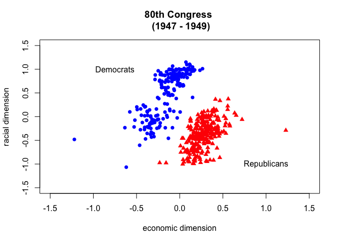
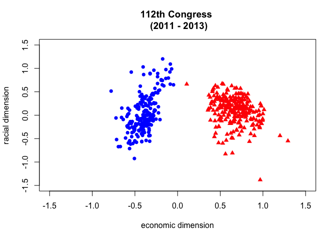
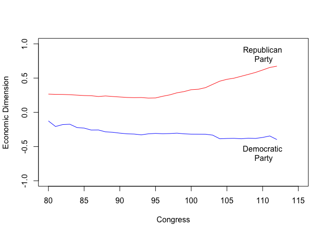
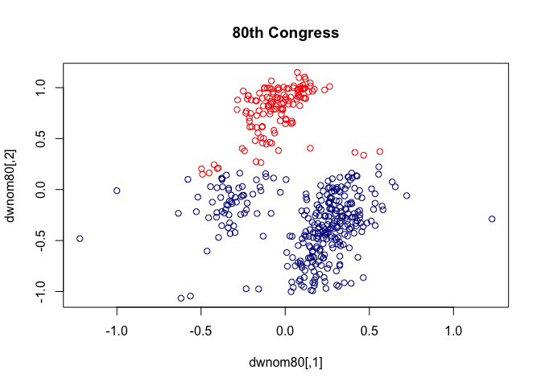
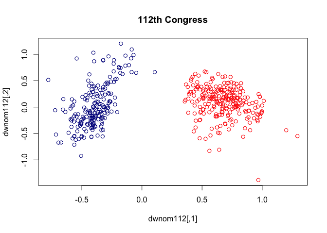
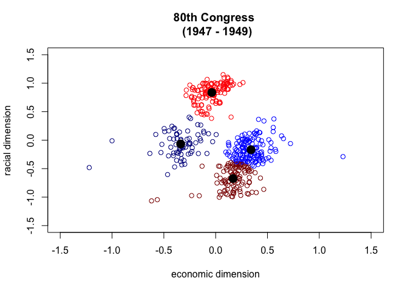
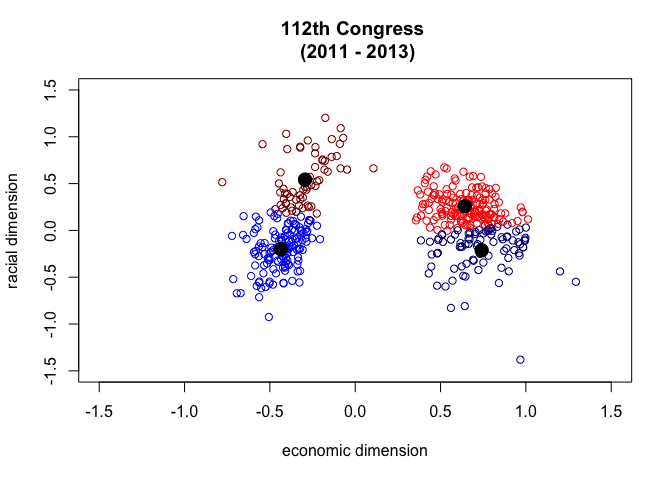

Cluster Analysis - Polarization in US Congress Over Time
================
Todd K. Hartman
2017-05-29

Housekeeping

``` r
## setwd("ENTER HERE)  # Set the working directory if needed

## Load the data
congress <-  read.csv("congress.csv")
head(congress)
```

    ##   congress district   state    party        name dwnom1 dwnom2
    ## 1       80        0     USA Democrat      TRUMAN -0.276  0.016
    ## 2       80        1 ALABAMA Democrat  BOYKIN  F. -0.026  0.796
    ## 3       80        2 ALABAMA Democrat   GRANT  G. -0.042  0.999
    ## 4       80        3 ALABAMA Democrat ANDREWS  G. -0.008  1.005
    ## 5       80        4 ALABAMA Democrat   HOBBS  S. -0.082  1.066
    ## 6       80        5 ALABAMA Democrat   RAINS  A. -0.170  0.870

``` r
## Subset the data by party
rep <- subset(congress, party == "Republican")
dem <- subset(congress, party == "Democrat")

## Now subset by Congress
rep80 <- subset(rep, subset = (congress == 80))
dem80 <- subset(dem, subset = (congress == 80))
rep112 <- subset(rep, subset = (congress == 112))
dem112 <- subset(dem, subset = (congress == 112))
```

Draw the scatterplot

``` r
xlab <- "economic dimension"
ylab <- "racial dimension"
lim <- c(-1.5, 1.5)

## Scatterplot for the 80th Congress
plot(dem80$dwnom1, dem80$dwnom2, pch = 16, col = "blue", 
     xlim = lim, ylim = lim, 
     xlab = xlab, ylab = ylab, 
     main = "80th Congress \n (1947 - 1949)")  # Democrats
points(rep80$dwnom1, rep80$dwnom2, pch = 17, col = "red")  # Republicans
text(-0.75, 1, "Democrats")
text(1, -1, "Republicans")
```



``` r
## Scatterplot for the 112th Congress
plot(dem112$dwnom1, dem112$dwnom2, pch = 16, col = "blue",
     xlim = lim, ylim = lim, xlab = xlab, ylab = ylab,
     main = "112th Congress \n (2011 - 2013)")
points(rep112$dwnom1, rep112$dwnom2, pch = 17, col = "red")
```



``` r
## Party median for each congress
dem.median <- tapply(dem$dwnom1, dem$congress, median)
rep.median <- tapply(rep$dwnom1, rep$congress, median)

## Democrats
plot(names(dem.median), dem.median, col = "blue", type = "l",
     xlim = c(80, 115), ylim = c(-1, 1), xlab = "Congress",
     ylab = "Economic Dimension")
## Republicans
lines(names(rep.median), rep.median, col = "red")
text(110, -0.6, "Democratic\n Party")
text(110, 0.85, "Republican\n Party")
```



Clustering

``` r
## Subset the data by Congressional session
session80 <- subset(congress, congress == 80)
session112 <- subset(congress, congress == 112)
```

Create a matrix of DW Nominate Scores

``` r
dwnom80 <- cbind(session80$dwnom1, session80$dwnom2)
dwnom112 <- cbind(session112$dwnom1, session112$dwnom2)
```

Run K-Means Clustering Algorithm

``` r
k80two.out <- kmeans(dwnom80, centers = 2, nstart = 5)
k112two.out <- kmeans(dwnom112, centers = 2, nstart = 5)
```

Check the Centroids from the K-Means Clustering

``` r
k80two.out$centers 
```

    ##          [,1]       [,2]
    ## 1  0.14681029 -0.3389293
    ## 2 -0.04843704  0.7827259

``` r
k112two.out$centers
```

    ##         [,1]       [,2]
    ## 1 -0.3912687 0.03260696
    ## 2  0.6776736 0.09061157

Check the Clusters

``` r
table(party = session80$party, cluster = k80two.out$cluster)
```

    ##             cluster
    ## party          1   2
    ##   Democrat    62 132
    ##   Other        2   0
    ##   Republican 247   3

``` r
table(party = session112$party, cluster = k112two.out$cluster)
```

    ##             cluster
    ## party          1   2
    ##   Democrat   200   0
    ##   Other        0   0
    ##   Republican   1 242

Plot the results

``` r
plot(dwnom80, col = k80two.out$cluster, main = "80th Congress")
```



``` r
plot(dwnom112, col = k112two.out$cluster, main = "112th Congress")
```



``` r
## kmeans with 4 clusters
k80four.out <- kmeans(dwnom80, centers = 4, nstart = 5)
k112four.out <- kmeans(dwnom112, centers = 4, nstart = 5)

palette(c("red4", "red", "blue", "blue4" )) 

## plotting the results using the labels and limits defined earlier
palette(c("blue", "red", "red4", "blue4" ))
plot(dwnom80, col = k80four.out$cluster, xlab = xlab, ylab = ylab,
     xlim = lim, ylim = lim, main = "80th Congress \n (1947 - 1949)")
## plotting the centroids
points(k80four.out$centers, pch = 16, cex = 2)
```



``` r
## 112th congress
palette(c("blue4", "red", "red4", "blue" ))
plot(dwnom112, col = k112four.out$cluster, xlab = xlab, ylab = ylab,
     xlim = lim, ylim = lim, main = "112th Congress \n (2011 - 2013)")
points(k112four.out$centers, pch = 16, cex = 2)
```


