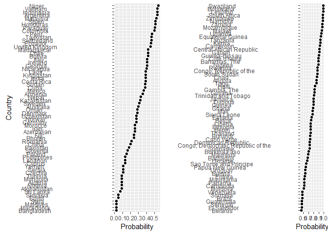

What is the conditional probability of having HIV if you test positive?
================
Todd K. Hartman
2016-11-28

Background information

``` r
## OraQuick Advance Rapid HIV-1/2
## A Centers for Disease Control study with 12,000 participants found:
## Test Sensitivity: 99.1% of HIV cases detected (true positive)                       [Pr(Positive|HIV)]
## thus, test misses .9% of real HIV cases (false negative)                            [Pr(Negative|HIV)]
##
## Test Specificity: 99.6% of healthy people test negative (true negative)             [Pr(Negative|No HIV)]
## thus, the test incorrectly returns a positive result in .4% cases (false positive)  [Pr(Positive|No HIV)]
##
## Prevalence rates for adults (aged 18-49) in 2014; CIA World Factbook
## weblink: https://www.cia.gov/library/publications/the-world-factbook/rankorder/rawdata_2155.txt
## http://aidsinfo.unaids.org/
## Prevalence of HIV in the UK: 3.3 cases per 1,000
```

Housekeeping

``` r
## Load packages via Pacman
pacman::p_load(ggplot2, gridExtra)

## Set the working directory
# setwd("ENTER YOUR DIRECTORY PATH HERE")
```

UK Only: Conditional probability of HIV given a positive test

``` r
## Bayes' Rule: Pr(A|B) = Pr(B|A)Pr(A) / [Pr(B|A)Pr(A) + Pr(B|A')Pr(A')] 
## Pr(HIV|positive) = Pr(Positive|HIV)Pr(HIV) / [Pr(Positive|HIV)Pr(HIV) + Pr(Positive|No HIV)Pr(No HIV)]
pr.hiv.uk <- .991*.0028 / ((.991*.0028)+(.004*.9972))
```

World: Conditional probability of HIV given a positive test

``` r
## Pull the data from the CIA World Factbook website (.txt file with fixed widths)
hiv <- read.fwf("https://www.cia.gov/library/publications/the-world-factbook/rankorder/rawdata_2155.txt",
                      width = c(7,51,4))  
dimnames(hiv)[[2]] <- c("id", "country", "percent")  # Add variables names
head(hiv)
```

    ##   id                                             country percent
    ## 1  1 Swaziland                                              27.7
    ## 2  2 Botswana                                               25.1
    ## 3  3 Lesotho                                                23.3
    ## 4  4 South Africa                                           18.9
    ## 5  5 Zimbabwe                                               16.7
    ## 6  6 Namibia                                                15.9

``` r
## Use Bayes' Rule to calculate the conditional probabilities
hiv$prop<- hiv$percent/100  # Transform percentages into proportions
hiv$pr.hiv <- (.991*hiv$prop)/((.991*hiv$prop)+(.004*(1-hiv$prop)))
hiv <- hiv[order(-hiv$pr.hiv, hiv$country), ]
subset(hiv, select = c(country, pr.hiv))  # Display by country
```

    ##                                                 country pr.hiv
    ## 1   Swaziland                                           0.9896
    ## 2   Botswana                                            0.9881
    ## 3   Lesotho                                             0.9869
    ## 4   South Africa                                        0.9830
    ## 5   Zimbabwe                                            0.9803
    ## 6   Namibia                                             0.9791
    ## 7   Zambia                                              0.9720
    ## 8   Mozambique                                          0.9667
    ## 9   Malawi                                              0.9649
    ## 10  Uganda                                              0.9509
    ## 11  Equatorial Guinea                                   0.9421
    ## 12  Tanzania                                            0.9332
    ## 13  Kenya                                               0.9327
    ## 14  Cameroon                                            0.9254
    ## 15  Central African Republic                            0.9166
    ## 16  Gabon                                               0.9098
    ## 17  Guinea-Bissau                                       0.9047
    ## 18  Cote d'Ivoire                                       0.8988
    ## 19  Bahamas, The                                        0.8918
    ## 20  Nigeria                                             0.8902
    ## 21  Rwanda                                              0.8779
    ## 22  Congo, Republic of the                              0.8751
    ## 23  South Sudan                                         0.8734
    ## 24  Chad                                                0.8654
    ## 25  Angola                                              0.8595
    ## 26  Togo                                                0.8590
    ## 27  Haiti                                               0.8298
    ## 28  Gambia, The                                         0.8212
    ## 29  Guyana                                              0.8204
    ## 30  Trinidad and Tobago                                 0.8061
    ## 31  Jamaica                                             0.8031
    ## 32  Djibouti                                            0.8001
    ## 33  Guinea                                              0.7959
    ## 34  Ghana                                               0.7871
    ## 35  Mali                                                0.7811
    ## 36  Sierra Leone                                        0.7787
    ## 37  Estonia                                             0.7654
    ## 38  Belize                                              0.7474
    ## 39  Liberia                                             0.7457
    ## 40  Ethiopia                                            0.7424
    ## 41  Benin                                               0.7407
    ## 42  Thailand                                            0.7390
    ## 43  Burundi                                             0.7355
    ## 44  Cabo Verde                                          0.7319
    ## 46  Congo, Democratic Republic of the                   0.7225
    ## 45  Dominican Republic                                  0.7225
    ## 47  Suriname                                            0.7186
    ## 48  Burkina Faso                                        0.7016
    ## 49  Mauritius                                           0.6970
    ## 50  Barbados                                            0.6875
    ## 51  Ukraine                                             0.6746
    ## 52  Sao Tome and Principe                               0.6607
    ## 53  Papua New Guinea                                    0.6424
    ## 54  Uruguay                                             0.6359
    ## 55  Burma                                               0.6325
    ## 56  Eritrea                                             0.6291
    ## 57  Mauritania                                          0.6221
    ## 58  Panama                                              0.6185
    ## 59  Cambodia                                            0.6148
    ## 60  Moldova                                             0.6110
    ## 62  Brazil                                              0.5781
    ## 63  Somalia                                             0.5781
    ## 61  Venezuela                                           0.5781
    ## 64  Guatemala                                           0.5736
    ## 65  El Salvador                                         0.5690
    ## 66  Senegal                                             0.5690
    ## 67  Belarus                                             0.5643
    ## 68  Niger                                               0.5495
    ## 69  Argentina                                           0.5392
    ## 71  Indonesia                                           0.5392
    ## 70  Vietnam                                             0.5392
    ## 72  Malaysia                                            0.5283
    ## 74  Honduras                                            0.5110
    ## 73  Spain                                               0.5110
    ## 75  Paraguay                                            0.5049
    ## 76  Colombia                                            0.4987
    ## 77  Peru                                                0.4723
    ## 78  Switzerland                                         0.4653
    ## 79  Tajikistan                                          0.4653
    ## 80  Ecuador                                             0.4581
    ## 81  United Kingdom                                      0.4506
    ## 83  Bolivia                                             0.4188
    ## 84  Chile                                               0.4188
    ## 82  Madagascar                                          0.4188
    ## 86  Georgia                                             0.4103
    ## 87  Ireland                                             0.4103
    ## 85  Italy                                               0.4103
    ## 88  Nicaragua                                           0.4015
    ## 89  Costa Rica                                          0.3924
    ## 90  India                                               0.3924
    ## 92  Kyrgyzstan                                          0.3924
    ## 91  Laos                                                0.3924
    ## 94  Cuba                                                0.3831
    ## 93  Sudan                                               0.3831
    ## 95  Mexico                                              0.3635
    ## 96  Armenia                                             0.3533
    ## 97  Nepal                                               0.3318
    ## 98  Kazakhstan                                          0.3205
    ## 99  Sweden                                              0.3088
    ## 100 Australia                                           0.2967
    ## 102 Denmark                                             0.2842
    ## 101 Oman                                                0.2842
    ## 103 Germany                                             0.2712
    ## 105 Norway                                              0.2712
    ## 104 Uzbekistan                                          0.2712
    ## 106 Azerbaijan                                          0.2578
    ## 108 Iran                                                0.2578
    ## 107 Morocco                                             0.2578
    ## 110 Bhutan                                              0.2439
    ## 109 Fiji                                                0.2439
    ## 111 Romania                                             0.2143
    ## 112 China                                               0.1987
    ## 113 Pakistan                                            0.1825
    ## 114 Slovenia                                            0.1655
    ## 115 Poland                                              0.1479
    ## 117 Cyprus                                              0.1295
    ## 116 Lebanon                                             0.1295
    ## 118 Philippines                                         0.1295
    ## 120 Czechia                                             0.1103
    ## 121 Serbia                                              0.1103
    ## 119 Yemen                                               0.1103
    ## 122 Afghanistan                                         0.0902
    ## 126 Albania                                             0.0902
    ## 125 Algeria                                             0.0902
    ## 124 Mongolia                                            0.0902
    ## 123 Tunisia                                             0.0902
    ## 127 Sri Lanka                                           0.0692
    ## 128 Egypt                                               0.0472
    ## 129 Slovakia                                            0.0472
    ## 130 Bangladesh                                          0.0242
    ## 131 Macedonia                                           0.0242
    ## 133 Maldives                                            0.0242
    ## 132 Syria                                               0.0242

``` r
## Create the figure
hiv$country2 <- factor(hiv$country, levels = hiv[order(hiv$pr.hiv), "country"])
median(hiv$pr.hiv)
```

    ## [1] 0.564

``` r
hiv2 <- subset(hiv, hiv$pr.hiv<median(hiv$pr.hiv))
hiv3 <- subset(hiv, hiv$pr.hiv>=median(hiv$pr.hiv))

x <- ggplot(hiv2, aes(y = country2, x = pr.hiv)) +
     geom_point(stat = "identity") +
     xlab("Probability") + 
     ylab("Country")
y <- ggplot(hiv3, aes(y = country2, x = pr.hiv)) +
     geom_point(stat = "identity") +
     xlab("Probability") +
     ylab("")
grid.arrange(x, y, ncol=2)
```


