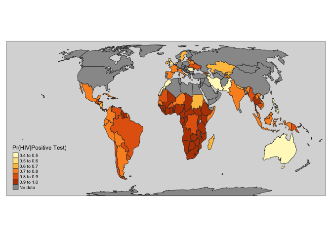

Lab Exercise: Conditional Probability and Global HIV
================
Todd K Hartman
Last updated 2017-12-04

Housekeeping

``` r
## Load packages via 'pacman' package manager
pacman::p_load(googleVis, tmap, tmaptools)
  
## Set the working directory
# setwd("ENTER YOUR WORKING DIRECTORY HERE")
```

Download and import the data

``` r
## Enter the URL and extract the file name
url.df <- "https://goo.gl/eouHbt"
file.df <- "rawdata_2155.txt"

## Only download the file if it doesn't exist in the working directory
if (!file.exists(file.df))
    download.file(url = url.df, destfile = file.df)

## Import the data (.txt file using fixed widths)
## (Open this file in Excel to determine columun widths)
hiv <- read.fwf(file.df, width = c(7, 51, 4), strip.white = TRUE)  
dimnames(hiv)[[2]] <- c("id", "country", "percent")  # Add variables names
head(hiv)
```

    ##   id      country percent
    ## 1  1    Swaziland    27.2
    ## 2  2      Lesotho    25.0
    ## 3  3     Botswana    21.9
    ## 4  4 South Africa    18.9
    ## 5  5      Namibia    13.8
    ## 6  6     Zimbabwe    13.5

Append the UK Prevalence Data for Comparison

``` r
## Convert factor name to string so we can add the UK
hiv$country <- as.character(hiv$country)

## Append UK data to end of dataset (update prevalence if needed)
hiv.rows <- nrow(hiv)
hiv[hiv.rows + 1, ] <- c(hiv.rows + 1, "United Kingdom", .16)

## Check that the data looks OK
hiv[hiv.rows + 1, ]
```

    ##      id        country percent
    ## 110 110 United Kingdom    0.16

Using Bayes' Rule to Calculate Conditional Probabilities

``` r
## Enter the data from the OraQuick test (update if needed)
true.pos <- .9167  # From the test sensitivity
false.neg <- .0833  # Converse rule (1 - true.pos)

true.neg <- .999  # From the test specificity
false.pos <- .001  # Converse rule (1 - true.neg)

## Convert prevalence percentages into proportions 
hiv$prop <- as.numeric(hiv$percent)/100

## Numerator
## Pr(B|A)Pr(A)
numerator <- true.pos * hiv$prop

## Denominator
## Pr(B|A)Pr(A) + Pr(B|A')Pr(A')
denominator <- (true.pos * hiv$prop) + (false.pos * (1-hiv$prop))

## Apply Bayes' Rule
hiv$pr.hiv <- numerator / denominator

## Rank the Countries 
hiv <- hiv[order(-hiv$pr.hiv, hiv$country), ]

## Display probabilities by country
subset(hiv, select = c(country, pr.hiv)) 
```

    ##                               country    pr.hiv
    ## 1                           Swaziland 0.9970888
    ## 2                             Lesotho 0.9967381
    ## 3                            Botswana 0.9961248
    ## 4                        South Africa 0.9953409
    ## 5                             Namibia 0.9932321
    ## 6                            Zimbabwe 0.9930589
    ## 7                              Zambia 0.9923525
    ## 8                          Mozambique 0.9922820
    ## 9                              Malawi 0.9893483
    ## 10                             Uganda 0.9845507
    ## 11                  Equatorial Guinea 0.9837642
    ## 12                              Kenya 0.9812479
    ## 13                           Tanzania 0.9783595
    ## 14           Central African Republic 0.9744871
    ## 15                           Cameroon 0.9731259
    ## 16                              Gabon 0.9716180
    ## 17                       Bahamas, The 0.9690244
    ## 19             Congo, Republic of the 0.9670259
    ## 20                      Guinea-Bissau 0.9670259
    ## 18                             Rwanda 0.9670259
    ## 21                            Nigeria 0.9647618
    ## 22                      Cote d'Ivoire 0.9621753
    ## 23                        South Sudan 0.9621753
    ## 24                              Haiti 0.9516058
    ## 25                               Togo 0.9516058
    ## 26                             Angola 0.9466799
    ## 27                             Belize 0.9438299
    ## 29                        Gambia, The 0.9406648
    ## 30                            Jamaica 0.9406648
    ## 28                       Sierra Leone 0.9406648
    ## 33                              Ghana 0.9371294
    ## 32                             Guyana 0.9371294
    ## 31                            Liberia 0.9371294
    ## 34                             Guinea 0.9331546
    ## 35                           Suriname 0.9286531
    ## 36                           Barbados 0.9235127
    ## 38                               Chad 0.9235127
    ## 37                           Djibouti 0.9235127
    ## 39                Trinidad and Tobago 0.9175870
    ## 42                            Burundi 0.9106812
    ## 41                           Ethiopia 0.9106812
    ## 40                           Thailand 0.9106812
    ## 43                              Benin 0.9025303
    ## 45                 Dominican Republic 0.9025303
    ## 44                               Mali 0.9025303
    ## 47                   Papua New Guinea 0.8927640
    ## 46                            Ukraine 0.8927640
    ## 51                       Burkina Faso 0.8808494
    ## 50                              Burma 0.8808494
    ## 48                         Cabo Verde 0.8808494
    ## 49                             Panama 0.8808494
    ## 53  Congo, Democratic Republic of the 0.8659901
    ## 52                             Latvia 0.8659901
    ## 60                             Brazil 0.8469403
    ## 54                           Cambodia 0.8469403
    ## 58                        El Salvador 0.8469403
    ## 57                            Eritrea 0.8469403
    ## 56                            Moldova 0.8469403
    ## 59                            Uruguay 0.8469403
    ## 55                          Venezuela 0.8469403
    ## 63                              Chile 0.8216366
    ## 61                            Georgia 0.8216366
    ## 64                          Guatemala 0.8216366
    ## 62                         Mauritania 0.8216366
    ## 65                           Paraguay 0.8216366
    ## 75                          Argentina 0.7863944
    ## 76                            Belarus 0.7863944
    ## 73                           Colombia 0.7863944
    ## 72                         Costa Rica 0.7863944
    ## 71                               Cuba 0.7863944
    ## 70                             France 0.7863944
    ## 69                           Honduras 0.7863944
    ## 68                          Indonesia 0.7863944
    ## 67                           Malaysia 0.7863944
    ## 66                              Niger 0.7863944
    ## 79                            Senegal 0.7863944
    ## 78                            Somalia 0.7863944
    ## 77                              Spain 0.7863944
    ## 74                            Vietnam 0.7863944
    ## 82                            Bolivia 0.7339276
    ## 81                            Ecuador 0.7339276
    ## 80                              India 0.7339276
    ## 85                              Italy 0.7339276
    ## 86                               Laos 0.7339276
    ## 87                             Mexico 0.7339276
    ## 84                               Peru 0.7339276
    ## 83                         Tajikistan 0.7339276
    ## 88                            Armenia 0.6475242
    ## 89                            Ireland 0.6475242
    ## 90                         Kazakhstan 0.6475242
    ## 91                         Kyrgyzstan 0.6475242
    ## 92                          Lithuania 0.6475242
    ## 93                         Madagascar 0.6475242
    ## 94                              Nepal 0.6475242
    ## 95                        Netherlands 0.6475242
    ## 96                          Nicaragua 0.6475242
    ## 97                              Sudan 0.6475242
    ## 98                             Sweden 0.6475242
    ## 110                    United Kingdom 0.5949893
    ## 99                            Albania 0.4785196
    ## 100                         Australia 0.4785196
    ## 101                        Azerbaijan 0.4785196
    ## 102                              Fiji 0.4785196
    ## 103                              Iran 0.4785196
    ## 109                             Malta 0.4785196
    ## 105                        Montenegro 0.4785196
    ## 106                           Morocco 0.4785196
    ## 107                          Pakistan 0.4785196
    ## 108                       Philippines 0.4785196
    ## 104                           Romania 0.4785196

Visualizing Global HIV Probabilities Given a Positive Test

``` r
## Create the interactive figure
bar.plot <- gvisBarChart(hiv, xvar = "country", yvar = "pr.hiv", 
                         options = list(legend = "none",
                                        vAxes = "[{textStyle:{fontSize: '16'}}]",
                                        chartArea = "{left:250,top:10,bottom:10}",
                                        width= 800, height = 3000) )
plot(bar.plot)

## Sort by country (alphabetically)
hiv <- hiv[order(hiv$country), ]

## Load the world shape file
data(World)

## List countries in hiv data where names don't match shape file
bad.names <- which(hiv$country %in% World@data$name == FALSE)
subset(hiv[bad.names, ], select = "country")
```

    ##                               country
    ## 17                       Bahamas, The
    ## 36                           Barbados
    ## 50                              Burma
    ## 48                         Cabo Verde
    ## 14           Central African Republic
    ## 53  Congo, Democratic Republic of the
    ## 19             Congo, Republic of the
    ## 45                 Dominican Republic
    ## 11                  Equatorial Guinea
    ## 29                        Gambia, The
    ## 109                             Malta
    ## 23                        South Sudan

``` r
## Check country names in shape file
countries <- as.character(World@data$name)
countries
```

    ##   [1] "Afghanistan"            "Angola"                
    ##   [3] "Albania"                "United Arab Emirates"  
    ##   [5] "Argentina"              "Armenia"               
    ##   [7] "Antarctica"             "Fr. S. Antarctic Lands"
    ##   [9] "Australia"              "Austria"               
    ##  [11] "Azerbaijan"             "Burundi"               
    ##  [13] "Belgium"                "Benin"                 
    ##  [15] "Burkina Faso"           "Bangladesh"            
    ##  [17] "Bulgaria"               "Bahamas"               
    ##  [19] "Bosnia and Herz."       "Belarus"               
    ##  [21] "Belize"                 "Bolivia"               
    ##  [23] "Brazil"                 "Brunei"                
    ##  [25] "Bhutan"                 "Botswana"              
    ##  [27] "Central African Rep."   "Canada"                
    ##  [29] "Switzerland"            "Chile"                 
    ##  [31] "China"                  "Cote d'Ivoire"         
    ##  [33] "Cameroon"               "Dem. Rep. Congo"       
    ##  [35] "Congo"                  "Colombia"              
    ##  [37] "Costa Rica"             "Cuba"                  
    ##  [39] "N. Cyprus"              "Cyprus"                
    ##  [41] "Czech Rep."             "Germany"               
    ##  [43] "Djibouti"               "Denmark"               
    ##  [45] "Dominican Rep."         "Algeria"               
    ##  [47] "Ecuador"                "Egypt"                 
    ##  [49] "Eritrea"                "Spain"                 
    ##  [51] "Estonia"                "Ethiopia"              
    ##  [53] "Finland"                "Fiji"                  
    ##  [55] "Falkland Is."           "France"                
    ##  [57] "Gabon"                  "United Kingdom"        
    ##  [59] "Georgia"                "Ghana"                 
    ##  [61] "Guinea"                 "Gambia"                
    ##  [63] "Guinea-Bissau"          "Eq. Guinea"            
    ##  [65] "Greece"                 "Greenland"             
    ##  [67] "Guatemala"              "Guyana"                
    ##  [69] "Honduras"               "Croatia"               
    ##  [71] "Haiti"                  "Hungary"               
    ##  [73] "Indonesia"              "India"                 
    ##  [75] "Ireland"                "Iran"                  
    ##  [77] "Iraq"                   "Iceland"               
    ##  [79] "Israel"                 "Italy"                 
    ##  [81] "Jamaica"                "Jordan"                
    ##  [83] "Japan"                  "Kazakhstan"            
    ##  [85] "Kenya"                  "Kyrgyzstan"            
    ##  [87] "Cambodia"               "Korea"                 
    ##  [89] "Kosovo"                 "Kuwait"                
    ##  [91] "Laos"                   "Lebanon"               
    ##  [93] "Liberia"                "Libya"                 
    ##  [95] "Sri Lanka"              "Lesotho"               
    ##  [97] "Lithuania"              "Luxembourg"            
    ##  [99] "Latvia"                 "Morocco"               
    ## [101] "Moldova"                "Madagascar"            
    ## [103] "Mexico"                 "Macedonia"             
    ## [105] "Mali"                   "Myanmar"               
    ## [107] "Montenegro"             "Mongolia"              
    ## [109] "Mozambique"             "Mauritania"            
    ## [111] "Malawi"                 "Malaysia"              
    ## [113] "Namibia"                "New Caledonia"         
    ## [115] "Niger"                  "Nigeria"               
    ## [117] "Nicaragua"              "Netherlands"           
    ## [119] "Norway"                 "Nepal"                 
    ## [121] "New Zealand"            "Oman"                  
    ## [123] "Pakistan"               "Panama"                
    ## [125] "Peru"                   "Philippines"           
    ## [127] "Papua New Guinea"       "Poland"                
    ## [129] "Puerto Rico"            "Dem. Rep. Korea"       
    ## [131] "Portugal"               "Paraguay"              
    ## [133] "Palestine"              "Qatar"                 
    ## [135] "Romania"                "Russia"                
    ## [137] "Rwanda"                 "W. Sahara"             
    ## [139] "Saudi Arabia"           "Sudan"                 
    ## [141] "S. Sudan"               "Senegal"               
    ## [143] "Solomon Is."            "Sierra Leone"          
    ## [145] "El Salvador"            "Somaliland"            
    ## [147] "Somalia"                "Serbia"                
    ## [149] "Suriname"               "Slovakia"              
    ## [151] "Slovenia"               "Sweden"                
    ## [153] "Swaziland"              "Syria"                 
    ## [155] "Chad"                   "Togo"                  
    ## [157] "Thailand"               "Tajikistan"            
    ## [159] "Turkmenistan"           "Timor-Leste"           
    ## [161] "Trinidad and Tobago"    "Tunisia"               
    ## [163] "Turkey"                 "Taiwan"                
    ## [165] "Tanzania"               "Uganda"                
    ## [167] "Ukraine"                "Uruguay"               
    ## [169] "United States"          "Uzbekistan"            
    ## [171] "Venezuela"              "Vietnam"               
    ## [173] "Vanuatu"                "Yemen"                 
    ## [175] "South Africa"           "Zambia"                
    ## [177] "Zimbabwe"

``` r
## Make a vector names from the shape file
good.names <- c("Bahamas", "Barbados", "Myanmar",
                "Cape Verde", "Central African Rep.",
                "Dem. Rep. Congo", "Congo", "Dominican Rep.", 
                "Eq. Guinea", "Gambia", "Malta", "S. Sudan")

## Replace 'bad' names with 'good' names
hiv[bad.names, ]$country <- good.names

## Check that the names all match
## (no data for 3 countries even though they appear in the file)
hiv$country %in% World@data$name
```

    ##   [1]  TRUE  TRUE  TRUE  TRUE  TRUE  TRUE  TRUE FALSE  TRUE  TRUE  TRUE
    ##  [12]  TRUE  TRUE  TRUE  TRUE  TRUE  TRUE FALSE  TRUE  TRUE  TRUE  TRUE
    ##  [23]  TRUE  TRUE  TRUE  TRUE  TRUE  TRUE  TRUE  TRUE  TRUE  TRUE  TRUE
    ##  [34]  TRUE  TRUE  TRUE  TRUE  TRUE  TRUE  TRUE  TRUE  TRUE  TRUE  TRUE
    ##  [45]  TRUE  TRUE  TRUE  TRUE  TRUE  TRUE  TRUE  TRUE  TRUE  TRUE  TRUE
    ##  [56]  TRUE  TRUE  TRUE  TRUE  TRUE  TRUE  TRUE  TRUE  TRUE  TRUE  TRUE
    ##  [67] FALSE  TRUE  TRUE  TRUE  TRUE  TRUE  TRUE  TRUE  TRUE  TRUE  TRUE
    ##  [78]  TRUE  TRUE  TRUE  TRUE  TRUE  TRUE  TRUE  TRUE  TRUE  TRUE  TRUE
    ##  [89]  TRUE  TRUE  TRUE  TRUE  TRUE  TRUE  TRUE  TRUE  TRUE  TRUE  TRUE
    ## [100]  TRUE  TRUE  TRUE  TRUE  TRUE  TRUE  TRUE  TRUE  TRUE  TRUE  TRUE

``` r
## Display countries that don't match
no.match <- which(hiv$country %in% World@data$name == FALSE)
hiv[no.match, ]
```

    ##      id    country percent  prop    pr.hiv
    ## 36   36   Barbados     1.3 0.013 0.9235127
    ## 48   48 Cape Verde     0.8 0.008 0.8808494
    ## 109 109      Malta     0.1 0.001 0.4785196

``` r
## Remove the 3 countries that don't match
match <- which(hiv$country %in% World@data$name == TRUE)
hiv2 <- hiv[match, ]

## Add a new variable called 'name' for merging
hiv2$name <- hiv2$country

## Create a new data.frame for merging
hiv3 <- data.frame(name = countries)

## Merge
hiv3 <- merge(hiv3, subset(hiv2, select = c("name", "pr.hiv")), by = "name", all = TRUE)

## Append hiv data to map shape file
hiv.map <- append_data(World, hiv3, key.shp = "name", key.data = "name")
```

    ## Keys match perfectly.

``` r
## Make the map
map1 <- qtm(hiv.map, fill = "pr.hiv", format = "World", 
            style = "gray", text.root = 5, 
            fill.title = "Pr(HIV|Positive Test)", 
            fill.textNA = "No data")
map1
```


