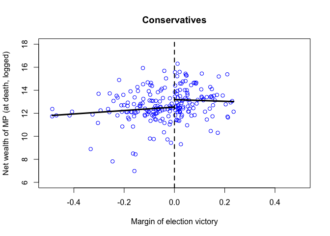
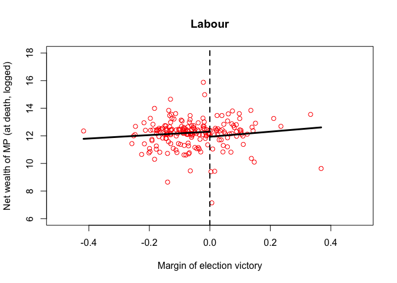
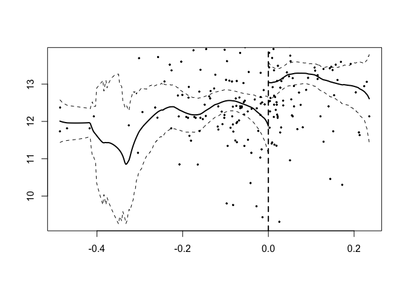

Regression Discontinuity Designs (RDDs)
================
Todd K. Hartman
2017-03-03

Housekeeping

``` r
## Get and set the working directory
getwd()
```

    ## [1] "/R"

``` r
setwd("/R/")
```

Load the MPs data

``` r
mp <- read.csv("MPs.csv")

## Check the data
head(mp)
```

    ##     surname firstname  party ln.gross    ln.net  yob  yod  margin.pre
    ## 1 Llewellyn     David   tory 12.13591 12.135906 1916 1992          NA
    ## 2    Morris     Claud labour 12.44809 12.448091 1920 2000          NA
    ## 3    Walker    George   tory 12.42845 10.349009 1914 1999 -0.05716820
    ## 4    Walker    Harold labour 11.91845 12.395034 1927 2003 -0.07250889
    ## 5    Waring      John   tory 13.52022 13.520219 1923 1989 -0.26968962
    ## 6     Brown    Ronald labour 12.46052  9.631837 1921 2002  0.34095868
    ##                     region      margin
    ## 1                    Wales  0.05690404
    ## 2       South West England -0.04973833
    ## 3       North East England -0.04158868
    ## 4 Yorkshire and Humberside  0.02329524
    ## 5           Greater London -0.23000582
    ## 6           Greater London  0.36797026

``` r
## Subset the data by major party
mp.labour <- subset(mp, subset = (party == "labour"))
mp.tory <- subset(mp, subset = (party == "tory"))
```

Data analysis - Tories

``` r
## Regressions for Tories - negative and positive margin
tory.fit1 <- lm(ln.net ~ margin, data = mp.tory[mp.tory$margin < 0, ])
tory.fit2 <- lm(ln.net ~ margin, data = mp.tory[mp.tory$margin > 0, ])

summary(tory.fit1)
```

    ## 
    ## Call:
    ## lm(formula = ln.net ~ margin, data = mp.tory[mp.tory$margin < 
    ##     0, ])
    ## 
    ## Residuals:
    ##     Min      1Q  Median      3Q     Max 
    ## -5.3195 -0.4721 -0.0349  0.6629  3.5798 
    ## 
    ## Coefficients:
    ##             Estimate Std. Error t value Pr(>|t|)    
    ## (Intercept)  12.5381     0.2142  58.540   <2e-16 ***
    ## margin        1.4911     1.2914   1.155    0.251    
    ## ---
    ## Signif. codes:  0 '***' 0.001 '**' 0.01 '*' 0.05 '.' 0.1 ' ' 1
    ## 
    ## Residual standard error: 1.434 on 119 degrees of freedom
    ## Multiple R-squared:  0.01108,    Adjusted R-squared:  0.002769 
    ## F-statistic: 1.333 on 1 and 119 DF,  p-value: 0.2506

``` r
exp(tory.fit1$coef[1])
```

    ## (Intercept) 
    ##    278762.5

``` r
summary(tory.fit2)
```

    ## 
    ## Call:
    ## lm(formula = ln.net ~ margin, data = mp.tory[mp.tory$margin > 
    ##     0, ])
    ## 
    ## Residuals:
    ##     Min      1Q  Median      3Q     Max 
    ## -3.8575 -0.8769  0.0007  0.8297  3.1257 
    ## 
    ## Coefficients:
    ##             Estimate Std. Error t value Pr(>|t|)    
    ## (Intercept)  13.1878     0.1920  68.693   <2e-16 ***
    ## margin       -0.7278     1.9824  -0.367    0.714    
    ## ---
    ## Signif. codes:  0 '***' 0.001 '**' 0.01 '*' 0.05 '.' 0.1 ' ' 1
    ## 
    ## Residual standard error: 1.289 on 100 degrees of freedom
    ## Multiple R-squared:  0.001346,   Adjusted R-squared:  -0.008641 
    ## F-statistic: 0.1348 on 1 and 100 DF,  p-value: 0.7143

``` r
exp(tory.fit2$coef[1])
```

    ## (Intercept) 
    ##    533813.5

``` r
## Tories - range of predictions
y1t.range <- c(min(mp.tory$margin), 0)  # Min to 0
y2t.range <- c(0, max(mp.tory$margin))  # 0 to max

## Prediction
y1.tory <- predict(tory.fit1, 
                   newdata = data.frame(margin = y1t.range))
y2.tory <- predict(tory.fit2, 
                   newdata = data.frame(margin = y2t.range))

## Create scatterplot with regression lines for Tories
plot(mp.tory$margin, mp.tory$ln.net, main = "Conservatives", 
     xlim = c(-0.5, 0.5), ylim = c(6, 18), xlab = "Margin of election victory",
     ylab = "Net wealth of MP (at death, logged)",
     col = "blue")
abline(v = 0, lty = "dashed", lwd = 2)
lines(y1t.range, y1.tory, col = "black", lwd = 3)  # Add regression line 1
lines(y2t.range, y2.tory, col = "black", lwd = 3)  # Add regression line 2
```



``` r
## Calculate average net wealth for Tory MP
tory.mp <- exp(y2.tory[1])

## Average net wealth for Tory non-MP
tory.nonmp <- exp(y1.tory[2])

## Causal effect (difference in average net wealth, in pounds)
tory.mp - tory.nonmp
```

    ##        1 
    ## 255050.9

Data analysis - Labour

``` r
## Regressions for Labour - negative vs positive margin
labour.fit1 <- lm(ln.net ~ margin, data = mp.labour[mp.labour$margin < 0, ])
labour.fit2 <- lm(ln.net ~ margin, data = mp.labour[mp.labour$margin > 0, ])

## Labour - range of predictions
y1l.range <- c(min(mp.labour$margin), 0)  # Min to 0
y2l.range <- c(0, max(mp.labour$margin))  # 0 to max

## Prediction
y1.labour <- predict(labour.fit1, 
                     newdata = data.frame(margin = y1l.range))
y2.labour <- predict(labour.fit2, 
                     newdata = data.frame(margin = y2l.range))

## Create scatterplot with regression lines for labour
plot(mp.labour$margin, mp.labour$ln.net, main = "Labour",
     xlim = c(-0.5, 0.5), ylim = c(6, 18), xlab = "Margin of election victory",
     ylab = "Net wealth of MP (at death, logged)", 
     col = "red")
abline(v = 0, lty = "dashed", lwd = 2)
lines(y1l.range, y1.labour, col = "black", lwd = 3)  # Add regression line 1
lines(y2l.range, y2.labour, col = "black", lwd = 3)  # Add regression line 2
```



``` r
## Calculate average net wealth for Tory MP
labour.mp <- exp(y2.labour[1])

## Average net wealth for Tory non-MP
labour.nonmp <- exp(y1.labour[2])

## Causal effect (difference in average net wealth, in pounds)
labour.mp - labour.nonmp
```

    ##         1 
    ## -67900.34

Placebo test

``` r
## Regressions for Tories - negative and positive margin at
tory.fit3 <- lm(margin.pre ~ margin, data = mp.tory[mp.tory$margin < 0, ])
tory.fit4 <- lm(margin.pre ~ margin, data = mp.tory[mp.tory$margin > 0, ])

## Difference between two intercepts is the estimated effect 
coef(tory.fit4)[1] - coef(tory.fit3)[1]
```

    ## (Intercept) 
    ## -0.01725578

Using the 'rdd' package

``` r
pacman::p_load(rdd)
tory.rdd.fit <- RDestimate(ln.net ~ margin, data = mp.tory)
summary(tory.rdd.fit)
```

    ## 
    ## Call:
    ## RDestimate(formula = ln.net ~ margin, data = mp.tory)
    ## 
    ## Type:
    ## sharp 
    ## 
    ## Estimates:
    ##            Bandwidth  Observations  Estimate  Std. Error  z value
    ## LATE       0.08313    115           1.1596    0.5305      2.186  
    ## Half-BW    0.04156     63           1.6910    0.9681      1.747  
    ## Double-BW  0.16625    179           0.9449    0.4105      2.302  
    ##            Pr(>|z|)   
    ## LATE       0.02881   *
    ## Half-BW    0.08067   .
    ## Double-BW  0.02134   *
    ## ---
    ## Signif. codes:  0 '***' 0.001 '**' 0.01 '*' 0.05 '.' 0.1 ' ' 1
    ## 
    ## F-statistics:
    ##            F      Num. DoF  Denom. DoF  p       
    ## LATE       3.333  3         111         0.044223
    ## Half-BW    2.510  3          59         0.134847
    ## Double-BW  5.084  3         175         0.004253

``` r
plot(tory.rdd.fit)
abline(v = 0, lty = "dashed", lwd = 2)
```


