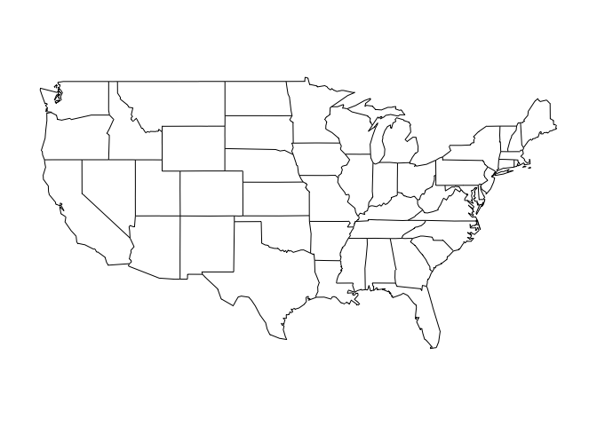
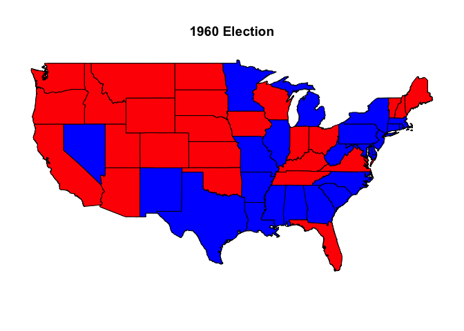

Mapping US Presidential Elections
================
Todd K. Hartman
2016-12-01

Housekeeping

``` r
pacman::p_load(animation, gsheet, maps)
```

Draw outline maps

``` r
map(database = "world")  # World map
```


``` r
map(database = "usa")  # US map
```


``` r
map(database = "state")  # US map with state borders
```



``` r
map(database = "state", region = "California")  # State map of California
```


Load the 2008 US presidential election vote share data

``` r
pres08<- read.csv("pres08.csv")
head(pres08)
```

    ##   state.name state Obama McCain EV
    ## 1    Alabama    AL    39     60  9
    ## 2     Alaska    AK    38     59  3
    ## 3    Arizona    AZ    45     54 10
    ## 4   Arkansas    AR    39     59  6
    ## 5 California    CA    61     37 55
    ## 6   Colorado    CO    54     45  9

``` r
## Two-party vote share (Democrats and REpublicans)
pres08$dem.vote <- pres08$Obama / (pres08$Obama + pres08$McCain)
pres08$rep.vote <- pres08$McCain / (pres08$Obama + pres08$McCain)

mean(pres08$dem.vote)
```

    ## [1] 0.5219152

``` r
mean(pres08$rep.vote)
```

    ## [1] 0.4780848

2008 US presidential election map

``` r
map(database = "state")
for (i in 1:nrow(pres08)) {
  if ((pres08$state[i] != "HI") & (pres08$state[i] != "AK") &
      (pres08$state[i] != "DC")) {
      map(database = "state", regions = pres08$state.name[i],
        col = ifelse(pres08$rep.vote[i] > pres08$dem.vote[i], "red", "blue"),
        fill = TRUE, add = TRUE)
  }
}
title("2008 US Election Map")
```


2016 US presidential election map

``` r
## Load the Google Sheet using the 'gsheet' package
url <- "https://docs.google.com/spreadsheets/d/133Eb4qQmOxNvtesw2hdVns073R68EZx4SfCnP4IGQf8"  # The Google Sheet URL
cook2016 <- gsheet2text(url)  # Function to download the Google Sheet
```

    ## No encoding supplied: defaulting to UTF-8.

``` r
pres16 <- read.csv(text=cook2016, skip = 4, na.strings="*", header = TRUE)  # Read the data into R, skipping the first 4 rows
head(pres16)  # Check the data
```

    ##              State Clinton..D.  Trump..R.    Others Clinton.. Trump..
    ## 1                                                                    
    ## 2       U.S. Total  65,210,600 62,661,237 7,604,640     48.1%   46.3%
    ## 3  13 Swing States  21,417,585 22,237,798 2,346,001     46.6%   48.3%
    ## 4 Non-Swing States  43,793,015 40,423,439 5,258,639     48.9%   45.2%
    ## 5                                                                    
    ## 6  13 Swing States                                                   
    ##   Others.. Dem..12.Margin Dem..16.Margin Margin.Shift Total..12.Votes
    ## 1                                                                    
    ## 2     5.6%           3.9%           1.9%        -2.0%     129,075,630
    ## 3     5.1%           3.6%          -1.8%        -5.4%      43,939,918
    ## 4     5.9%           4.0%           3.8%        -0.2%      85,135,712
    ## 5                                                                    
    ## 6                                                                    
    ##   Total..16.Votes Raw.Votes.vs...12
    ## 1                                  
    ## 2     135,476,477              5.0%
    ## 3      46,001,384              4.7%
    ## 4      89,475,093              5.1%
    ## 5                                  
    ## 6

``` r
## Tidy the data
bad.rows <- c(1:6, 20:21)  # Identify rows with extraneous info.
pres16 <- pres16[-bad.rows, ]  # Remove bad rows
pres16$State <- gsub("[*]", "", pres16$State)  # Remove the asterisk by the state names
head(pres16, n = 20)
```

    ##                   State Clinton..D. Trump..R.  Others Clinton.. Trump..
    ## 7               Arizona   1,161,167 1,252,401 163,520     45.1%   48.6%
    ## 8              Colorado   1,338,870 1,202,482 238,852     48.2%   43.3%
    ## 9               Florida   4,504,975 4,617,886 297,178     47.8%   49.0%
    ## 10                 Iowa     653,669   800,983 111,314     41.7%   51.1%
    ## 11                Maine     354,873   334,878  51,239     47.9%   45.2%
    ## 12             Michigan   2,268,839 2,279,543 250,902     47.3%   47.5%
    ## 13            Minnesota   1,367,716 1,322,951 254,146     46.4%   44.9%
    ## 14               Nevada     539,260   512,058  74,067     47.9%   45.5%
    ## 15        New Hampshire     348,526   345,790  49,842     46.8%   46.5%
    ## 16       North Carolina   2,189,281 2,362,634 189,562     46.2%   49.8%
    ## 17                 Ohio   2,394,164 2,841,005 261,318     43.6%   51.7%
    ## 18         Pennsylvania   2,914,422 2,961,187 214,571     47.9%   48.6%
    ## 19            Wisconsin   1,381,823 1,404,000 189,490     46.4%   47.2%
    ## 22              Alabama     729,547 1,318,255  75,570     34.4%   62.1%
    ## 23               Alaska     116,454   163,487  38,767     36.5%   51.3%
    ## 24             Arkansas     380,494   684,872  65,269     33.7%   60.6%
    ## 25           California   8,543,280 4,373,049 796,792     62.3%   31.9%
    ## 26          Connecticut     897,572   673,215  74,133     54.6%   40.9%
    ## 27             Delaware     235,603   185,127  20,860     53.4%   41.9%
    ## 28 District of Columbia     282,830    12,723  15,715     90.9%    4.1%
    ##    Others.. Dem..12.Margin Dem..16.Margin Margin.Shift Total..12.Votes
    ## 7      6.3%          -9.1%          -3.5%         5.5%       2,299,254
    ## 8      8.6%           5.4%           4.9%        -0.5%       2,569,521
    ## 9      3.2%           0.9%          -1.2%        -2.1%       8,474,179
    ## 10     7.1%           5.8%          -9.4%       -15.2%       1,582,180
    ## 11     6.9%          15.3%           2.7%       -12.6%         713,180
    ## 12     5.2%           9.5%          -0.2%        -9.7%       4,730,961
    ## 13     8.6%           7.7%           1.5%        -6.2%       2,936,561
    ## 14     6.6%           6.7%           2.4%        -4.3%       1,014,918
    ## 15     6.7%           5.6%           0.4%        -5.2%         710,972
    ## 16     4.0%          -2.0%          -3.7%        -1.6%       4,505,372
    ## 17     4.8%           3.0%          -8.1%       -11.1%       5,580,840
    ## 18     3.5%           5.4%          -0.8%        -6.2%       5,753,546
    ## 19     6.4%           6.9%          -0.7%        -7.7%       3,068,434
    ## 22     3.6%         -22.2%         -27.7%        -5.5%       2,074,338
    ## 23    12.2%         -14.0%         -14.8%        -0.8%         300,495
    ## 24     5.8%         -23.7%         -26.9%        -3.2%       1,069,468
    ## 25     5.8%          23.1%          30.4%         7.3%      13,038,547
    ## 26     4.5%          17.3%          13.6%        -3.7%       1,558,114
    ## 27     4.7%          18.6%          11.4%        -7.2%         413,890
    ## 28     5.0%          83.6%          86.8%         3.1%         293,764
    ##    Total..16.Votes Raw.Votes.vs...12
    ## 7        2,577,088             12.1%
    ## 8        2,780,204              8.2%
    ## 9        9,420,039             11.2%
    ## 10       1,565,966             -1.0%
    ## 11         740,990              3.9%
    ## 12       4,799,284              1.4%
    ## 13       2,944,813              0.3%
    ## 14       1,125,385             10.9%
    ## 15         744,158              4.7%
    ## 16       4,741,477              5.2%
    ## 17       5,496,487             -1.5%
    ## 18       6,090,180              5.9%
    ## 19       2,975,313             -3.0%
    ## 22       2,123,372              2.4%
    ## 23         318,708              6.1%
    ## 24       1,130,635              5.7%
    ## 25      13,713,121              5.2%
    ## 26       1,644,920              5.6%
    ## 27         441,590              6.7%
    ## 28         311,268              6.0%

``` r
## Calculate 2-party vote share
pres16$dem.vote <- as.numeric(gsub(",", "", pres16$`Clinton..D.`)) / 
    as.numeric(gsub(",", "", pres16$`Total..16.Votes`))
pres16$rep.vote <- as.numeric(gsub(",", "", pres16$`Trump..R.`)) / 
    as.numeric(gsub(",", "", pres16$`Total..16.Votes`))

## Create the map
map(database = "state")
    for (i in 1:nrow(pres16)) {
        if ((pres16$State[i] != "Hawaii") & (pres16$State[i] != "Alaska") &
            (pres16$State[i] != "District of Columbia")) {
                map(database = "state", regions = pres16$State[i],
                col = ifelse(pres16$rep.vote[i] > pres16$dem.vote[i], "red", "blue"),
                fill = TRUE, add = TRUE)
        }
}
title("2016 US Election Map")
```


Animate US presidential election maps from 1960 to 2012 (BY STATE)

``` r
elections <- read.csv("elections.csv")

## Sum county-level votes by state & year
election.rep <- with(elections, aggregate(rep ~ year + state, FUN = "sum"))
election.dem <- with(elections, aggregate(dem ~ year + state, FUN = "sum"))
election.other <- with(elections, aggregate(other ~ year + state, FUN = "sum"))

## Merge the datasets
election.total <- merge(election.rep, election.dem, by = c("year","state"))
election.total <- merge(election.total, election.other, by = c("year", "state"))

## Calculate the 2-party vote share by state & year
election.total$total <- rowSums(election.total[, c("rep", "dem", "other")])
election.total$rep.vote <- election.total$rep / election.total$total
election.total$dem.vote <- election.total$dem / election.total$total

## Function to make the US presidential election maps by STATE
## x = data.frame, y = year
election.map <- function(x, y){
  vote.share <- subset(x, year == y)
  map(database = "state")
  for (i in 1:48) {
    map(database = "state", regions = vote.share$state[i],
      col = ifelse(vote.share$rep.vote[i] > vote.share$dem.vote[i], "red", "blue"),
      fill = TRUE, add = TRUE)
  }
   title(main = paste(y, "Election"))
}

## Print all election maps by year
for (i in seq(1960, 2012, 4)) {
    election.map(election.total, i)
}
```



``` r
## Animate the map
par(cex = 1.5)
saveHTML({
    for (i in seq(1960, 2012, 4)) {
        election.map(election.total, i)
    }
}, htmlfile = "mapping_us_elections_by_state.html", outdir = getwd(), autobrowse = FALSE)
```

    ## animation option 'nmax' changed: 50 --> 686

    ## animation option 'nmax' changed: 686 --> 50

    ## HTML file created at: mapping_us_elections_by_state.html

Animate US presidential election maps from 1960 to 2012 (BY COUNTY)

``` r
## Create a character vector of `state,county' inputs
elections$poly <- paste(elections$state, elections$county, sep = ",")

## Calculate county-level two-party vote share
elections$dem.county <- elections$dem / (elections$dem + elections$rep)
elections$rep.county <- elections$rep / (elections$dem + elections$rep)

## Create colors based upon two-party vote share
elections$colors <- rgb(red = elections$rep.county, blue = elections$dem.county, green = 0)
    
par(cex = 1.5)
saveHTML({
  for (i in 1:14) {
    data1 <- subset(elections,
                         subset = (year == 1960 + 4 * (i - 1)))
    states <- unique(data1$state)
    map(database = "state")
    for (j in 1:length(states)) {
      data2 <- subset(data1,
                           subset = (state == states[j]))
      map(database = "county", region = data2$poly,
          col = data2$color, fill = TRUE, add = TRUE)
    }
    title(main = paste("County-level Election Results,",
                       1960 + 4 * (i - 1), "Presidential Election"))
  }
}, htmlfile = "mapping_us_elections_by_county.html", outdir = getwd(), autobrowse = FALSE)
```

    ## animation option 'nmax' changed: 50 --> 686

    ## animation option 'nmax' changed: 686 --> 50

    ## HTML file created at: mapping_us_elections_by_county.html
