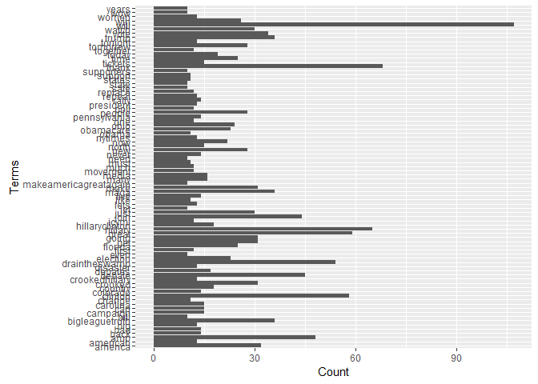
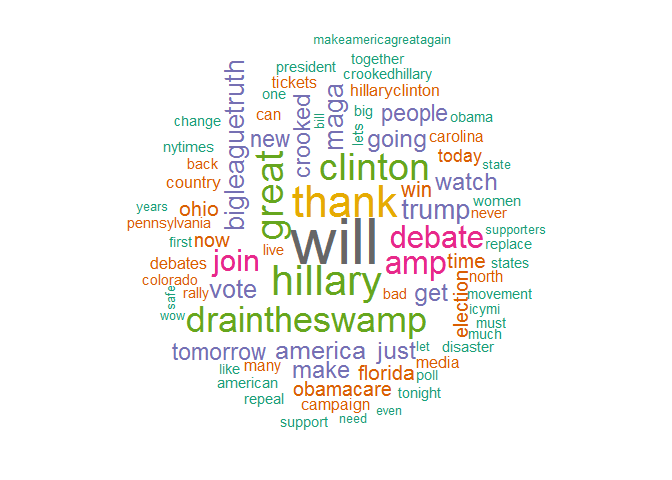

Scraping Twitter Data Using R
================
Todd K. Hartman
2016-11-28

IMPORTANT

``` r
## Create a Twitter API key and token (as a developer) BEFORE scraping the data
## Website: htpps://apps.twitter.com (create a new developer app, then generate a new key and token)
```

Housekeeping

``` r
# Render the R script from the command line (not this R script)!
# rmarkdown::render("twitter_textual_analysis.R")

## Set the workding directory
# setwd("YOUR DIRECTORY HERE")

## Load packages via pacman
pacman::p_load(ggplot2, httr, PKI, RColorBrewer, rmarkdown, ROAuth, SnowballC, tm, twitteR, wordcloud)
```

Store encrypted Twitter key and token as a list in separate R.Data file \[ ONLY RUN ONCE \]

``` r
# ## Create public & private encryption keys
# rsa.key <- PKI.genRSAkey(bits = 4096L)  # Create a pair of encryption keys
# public.key <- PKI.save.key(rsa.key, private=FALSE)  # Get your public encryption key
# private.key <- PKI.save.key(rsa.key)  # Get your private encryption key
# keys <- list(public.key, private.key)  # Store the encryption keys in a list object
# save(keys, file = "encryption_keys.RData")  # Save the encryption keys in a separate file
#
# ## Encrypt Twitter keys and tokens using your PUBLIC encryption key
# public.rsa <- PKI.load.key(keys[[1]])  # Load your public encryption key
# api.key <- PKI.encrypt(charToRaw("ENTER YOUR TWITTER API KEY HERE"), public.rsa)
# api.secret <- PKI.encrypt(charToRaw("ENTER YOUR TWITTER API KEY SECRET HERE"), public.rsa)
# access.token <- PKI.encrypt(charToRaw("ENTER YOUR TWITTER TOKEN HERE"), public.rsa)
# access.token.secret <- PKI.encrypt(charToRaw("ENTER YOUR TWITTER TOKEN SECRET HERE"), public.rsa)
# twitter_keys <- list(api.key, api.secret, access.token, access.token.secret)  # Store the encrypted Twitter keys in a list object
# save(twitter_keys, file = "twitter_keys.RData") # Save the Twitter keys in a separate file
#
# ## Clear the workspace and history to keep secret information from prying eyes
# rm(rsa.key, public.key, private.key, public.rsa, api.key, api.secret, 
#   access.token, access.token.secret)  # Remove keys
#
# clearhistory <- function() {  # Create a function to wipe your R history
#    write("", file=".blank")
#    loadhistory(".blank")
#    unlink(".blank")
#  }
# clearhistory()  # Remove sensitive data from your R History (CLEARS ALL OF YOUR HISTORY)
#
```

Load your Twitter API Keys

``` r
load("encryption_keys.RData")  # Load your encryption keys
load("twitter_keys.RData")  # Load your encrypted Twitter info.

## Activate your decrypted Twitter keys and tokens
private.rsa <- PKI.load.key(keys[[2]])  # Load your public encryption key
setup_twitter_oauth(
    rawToChar(PKI.decrypt(twitter_keys[[1]], private.rsa)),
    rawToChar(PKI.decrypt(twitter_keys[[2]], private.rsa)),
    rawToChar(PKI.decrypt(twitter_keys[[3]], private.rsa)),
    rawToChar(PKI.decrypt(twitter_keys[[4]], private.rsa))
)
```

    ## [1] "Using direct authentication"

``` r
rm(keys, twitter_keys, private.rsa)  # Remove keys
```

Scrape Twitter REST data

``` r
## Scrape the last 1,000 tweets from a user
tw.timeline <- userTimeline("realDonaldTrump", n = 1000)
tw.timeline[1:10]
```

    ## [[1]]
    ## [1] "realDonaldTrump: If Cuba is unwilling to make a better deal for the Cuban people, the Cuban/American people and the U.S. as a whole, I will terminate deal."
    ## 
    ## [[2]]
    ## [1] "realDonaldTrump: Serious voter fraud in Virginia, New Hampshire and California - so why isn't the media reporting on this? Serious bias - big problem!"
    ## 
    ## [[3]]
    ## [1] "realDonaldTrump: states instead of the 15 states that I visited. I would have won even more easily and convincingly (but smaller states are forgotten)!"
    ## 
    ## [[4]]
    ## [1] "realDonaldTrump: It would have been much easier for me to win the so-called popular vote than the Electoral College in that I would only campaign in 3 or 4--"
    ## 
    ## [[5]]
    ## [1] "realDonaldTrump: In addition to winning the Electoral College in a landslide, I won the popular vote if you deduct the millions of people who voted illegally"
    ## 
    ## [[6]]
    ## [1] "realDonaldTrump: Trump is going to be our President. We owe him an open mind and the chance to lead.\" So much time and money will be spent - same result! Sad"
    ## 
    ## [[7]]
    ## [1] "realDonaldTrump: this election. That is a direct threat to our democracy.\" She then said, \"We have to accept the results and look to the future, Donald --"
    ## 
    ## [[8]]
    ## [1] "realDonaldTrump: of position.\" Then, separately she stated, \"He said something truly horrifying ... he refused to say that he would respect the results of --"
    ## 
    ## [[9]]
    ## [1] "realDonaldTrump: during a general election. I, for one, am appalled that somebody that is the nominee of one of our two major parties would take that kind --"
    ## 
    ## [[10]]
    ## [1] "realDonaldTrump: and fair elections. We've accepted the outcomes when we may not have liked them, and that is what must be expected of anyone standing on a -"

``` r
## Or, to scrape the last 1,000 tweets about a user (using the @ sign)
tw.user <- searchTwitter('@NateSilver538', lang = "en", n = 1000)

## Or, to scrape the last 1,000 tweets using hashtags (in English)
tw.hashtag <- searchTwitter("#donaldtrump", lang = "en", n=1000)
```

Process the tweets

``` r
## Convert tweets to a data frame
tweets.df <- twListToDF(tw.timeline)
head(tweets.df$text)
```

    ## [1] "If Cuba is unwilling to make a better deal for the Cuban people, the Cuban/American people and the U.S. as a whole, I will terminate deal."   
    ## [2] "Serious voter fraud in Virginia, New Hampshire and California - so why isn't the media reporting on this? Serious bias - big problem!"        
    ## [3] "states instead of the 15 states that I visited. I would have won even more easily and convincingly (but smaller states are forgotten)!"       
    ## [4] "It would have been much easier for me to win the so-called popular vote than the Electoral College in that I would only campaign in 3 or 4--" 
    ## [5] "In addition to winning the Electoral College in a landslide, I won the popular vote if you deduct the millions of people who voted illegally" 
    ## [6] "Trump is going to be our President. We owe him an open mind and the chance to lead.\" So much time and money will be spent - same result! Sad"

``` r
## Load tweets as raw corpus 
corpus.raw <- Corpus(VectorSource(tweets.df$text))

## Remove URLs
removeURL <- function(x) gsub("http[^[:space:]]*", "", x)  # function to remove URLs
corpus.prep <- tm_map(corpus.raw, content_transformer(removeURL))

## Remove anything else other than English letters or spaces
removeNumPunct <- function(x) gsub("[^[:alpha:][:space:]]*", "", x)  # function to remove extraneous characters
corpus.prep <- tm_map(corpus.prep, content_transformer(removeNumPunct))

## Remove extra whitespace in the data
corpus.prep <- tm_map(corpus.prep, stripWhitespace)

## Make tweets lower case
corpus.prep <- tm_map(corpus.prep, content_transformer(tolower))

## Remove stop words 
corpus <- tm_map(corpus.prep, removeWords, stopwords("english"))

## Reduce words to their root form 
corpus.copy <- corpus  # Make a copy for later word retrieval
# corpus <- tm_map(corpus, stemDocument)

## Check the contents of the processed tweets
k <- 20  # Number of tweets to display
for(i in 1:k){
    cat(paste("Tweet", i))
    print(content(corpus[[i]]))
}
```

    ## Tweet 1[1] " cuba  unwilling  make  better deal   cuban people  cubanamerican people   us   whole  will terminate deal"
    ## Tweet 2[1] "serious voter fraud  virginia new hampshire  california   isnt  media reporting   serious bias big problem"
    ## Tweet 3[1] "states instead   states   visited    won even  easily  convincingly  smaller states  forgotten"
    ## Tweet 4[1] "    much easier    win  socalled popular vote   electoral college      campaign   "
    ## Tweet 5[1] " addition  winning  electoral college   landslide  won  popular vote   deduct  millions  people  voted illegally"
    ## Tweet 6[1] "trump  going    president  owe   open mind   chance  lead  much time  money will  spent  result sad"
    ## Tweet 7[1] " election    direct threat   democracy   said    accept  results  look   future donald "
    ## Tweet 8[1] " position  separately  stated  said something truly horrifying  refused  say    respect  results  "
    ## Tweet 9[1] "  general election   one  appalled  somebody    nominee  one   two major parties  take  kind "
    ## Tweet 10[1] " fair elections weve accepted  outcomes   may   liked      must  expected  anyone standing   "
    ## Tweet 11[1] "hillarys debate answer  delay   horrifying     way  democracy works  around  years weve  free "
    ## Tweet 12[1] "hillary clinton conceded  election   called  just prior   victory speech    results   nothing will change"
    ## Tweet 13[1] " democrats   incorrectly thought   going  win asked   election night tabulation  accepted   anymore"
    ## Tweet 14[1] " green party scam  fill   coffers  asking  impossible recounts  now  joined   badly defeated amp demoralized dems"
    ## Tweet 15[1] "fidel castro  dead"
    ## Tweet 16[1] "  working hard even  thanksgiving trying  get carrier ac company  stay   us indiana making progress will know soon"
    ## Tweet 17[1] "happy thanksgiving  everyone  will together make america great "
    ## Tweet 18[1] "let us give thanks       let us boldly face  exciting new frontiers  lie ahead happy th "
    ## Tweet 19[1] "bus crash  tennessee  sad amp  terrible condolences   family members  loved ones  beautiful children will  remembered"
    ## Tweet 20[1] "  seriously considering dr ben carson   head  hud ive gotten  know  wellhes  greatly talented person  loves people"

Create a Term-Document Matrix

``` r
tdm <- TermDocumentMatrix(corpus)
tdm
```

    ## <<TermDocumentMatrix (terms: 1784, documents: 503)>>
    ## Non-/sparse entries: 4848/892504
    ## Sparsity           : 99%
    ## Maximal term length: 22
    ## Weighting          : term frequency (tf)

``` r
## Display frequent terms
(freq.terms <- findFreqTerms(tdm, lowfreq = 20))
```

    ##  [1] "america"        "amp"            "bigleaguetruth" "clinton"       
    ##  [5] "crooked"        "debate"         "draintheswamp"  "election"      
    ##  [9] "florida"        "get"            "going"          "great"         
    ## [13] "hillary"        "join"           "just"           "maga"          
    ## [17] "make"           "new"            "now"            "obamacare"     
    ## [21] "ohio"           "people"         "thank"          "time"          
    ## [25] "tomorrow"       "trump"          "vote"           "watch"         
    ## [29] "will"           "win"

``` r
term.freq <- rowSums(as.matrix(tdm))
term.freq <- subset(term.freq, term.freq >= 10)
df <- data.frame(term = names(term.freq), freq = term.freq)

## Create the figure
ggplot(df, aes(x = term, y = freq)) +
           geom_bar(stat = "identity") + 
           xlab("Terms") + 
           ylab("Count") +
           coord_flip()
```



Create a word cloud to visualize tweets

``` r
word.freq <- sort(rowSums(as.matrix(tdm)), decreasing = TRUE)
wordcloud(words = names(word.freq), 
          freq = word.freq, 
          min.freq = 10, 
          random.order = FALSE,
          colors=brewer.pal(8, "Dark2"))
```



Alternative function to clean Twitter data

``` r
clean.text <- function(x)
{
    x <- tolower(x)      # To lower case
    x <- gsub("rt", "", x)  # Remove 'rt'
    x <- gsub("@\\w+", "", x)  # Remove '@'
    x <- gsub("[[:punct:]]", "", x)  # Remove punctuation
    x <- gsub("[[:digit:]]", "", x)  # Remove numbers
    x <- gsub("http\\w+", "", x)  # Remove 'http' links
    x <- gsub("[ |\t]{2,}", "", x)  # Remove tabs
    x <- gsub("^ ", "", x)  # Remove leading blank spaces
    x <- gsub(" $", "", x)  # Remove ending blank spaces
    return(x)
}
```
